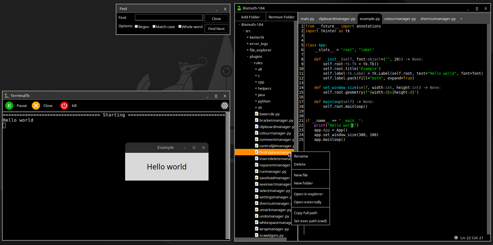

# Bismuth-184
As the name implies this project might be very unstable and can break down in the blink of an eye. When it's running it's an integrated development environment for Python/C/C++/Java. So far it only works with Python/C++ but making it work with C/Java should be trivial. Only works on Unix for now because of its dependancy on my other project `BetterTk` and its subproject `TerminalTk`.

# Dependencies
### Python
* xterm/konsole
* PIL (`pip install Pillow`)

### C/C++
* g++
	* Ubuntu: `sudo apt install g++`
	* Windows: install `mingw`, in `mingw-get` install (mingw32-gcc-g++-bin, mingw32-gcc-g++-dev, mingw32-gcc-g++-doc, mingw32-gcc-g++-man)
* xterm/konsole
* PIL (`pip install Pillow`)

### Java
* jre
* xterm/konsole
* PIL (`pip install Pillow`)